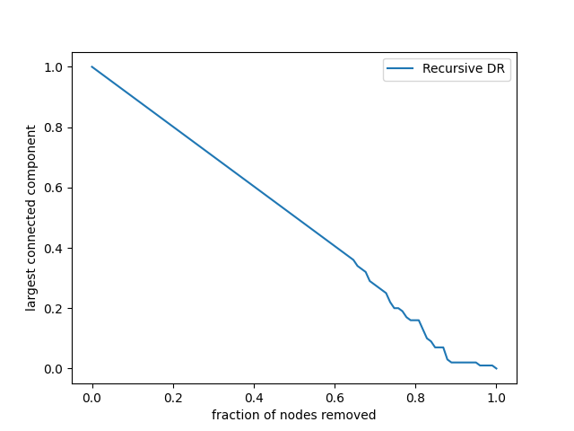
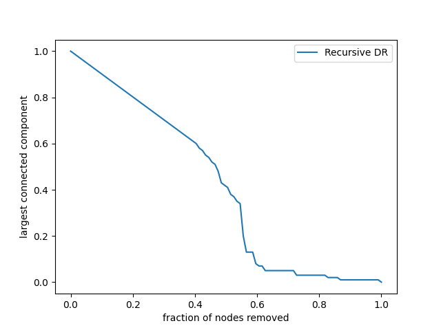
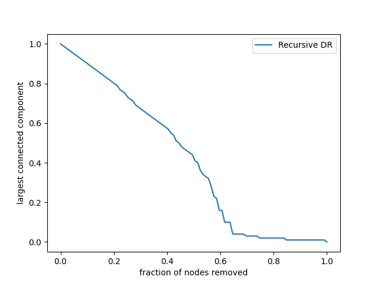

## DomiRank
复合中心性指标

### 项目简介

确定互连基础设施和复杂系统的关键要素对于确保系统功能和完整性至关重要。

这项工作量化了网络节点在各自社区中的主导地位，引入了一个中心性指标 DomiRank，它通过可调参数整合了本地和全局拓扑信息。我们提出了一个用于 DomiRank 中心性的分析公式和一种高效的可并行化算法，使其适用于大规模网络。

从网络的结构和功能的角度来看，DomiRank 值高的节点突出了脆弱的邻域，这些邻域的完整性和功能高度依赖于这些主导节点。

为了强调支配性和脆弱性之间的这种关系，我们表明 DomiRank 在生成有针对性的攻击方面系统性地优于其他中心性指标，这些攻击有效地破坏了网络结构并破坏了其在合成和现实世界拓扑中的功能。

此外，我们表明，基于 DomiRank 的攻击会在网络中造成更持久的损害，阻碍其反弹能力，从而损害系统弹性。DomiRank 中心性利用其定义中嵌入的竞争机制来揭示网络的脆弱性，为设计策略以减轻漏洞和增强关键基础设施的弹性铺平了道路。

### 项目使用效果图

```shell
$ /bin/python3 /home/user-name/gitpro/DomiRank/main.py
Current Interval : [-16.0, -1.0]
Current Interval : [-16.0, -1.3061224489795917]
Current Interval : [-16.0, -1.695364238410596]
Current Interval : [-16.0, -2.183368869936034]
Current Interval : [-16.0, -2.7845003399048265]
Current Interval : [-16.0, -3.509102591561362]
Current Interval : [-5.75584050588442, -3.509102591561362]
Current Interval : [-5.75584050588442, -3.8885691399412585]
Current Interval : [-5.75584050588442, -4.231780649431364]
Current Interval : [-5.75584050588442, -4.531766526135183]
Current Interval : [-5.75584050588442, -4.786234354432965]
Current Interval : [-5.75584050588442, -4.996663920229527]
Current Interval : [-5.349451522475211, -4.996663920229527]
Current Interval : [-5.349451522475211, -5.08042536166895]
Current Interval : [-5.349451522475211, -5.145112832261159]
Current Interval : [-5.349451522475211, -5.194719892650121]
Current Interval : [-5.349451522475211, -5.2325575171891305]
Current Interval : [-5.349451522475211, -5.261299452856269]
Current Interval : [-5.349451522475211, -5.28306397494625]
Current Interval : [-5.349451522475211, -5.299505903552105]
Current Interval : [-5.349451522475211, -5.311904668416593]
Current Interval : [-5.349451522475211, -5.321241882312559]
Current Interval : [-5.349451522475211, -5.32826636305423]
Current Interval : [-5.349451522475211, -5.333546906349911]
Current Interval : [-5.349451522475211, -5.337514187568367]
Current Interval : [-5.349451522475211, -5.340493523837423]
Current Interval : [-5.349451522475211, -5.342730209679854]
Current Interval : [-5.349451522475211, -5.3444089539462]
Current Interval : [-5.346929049327728, -5.3444089539462]
Current Interval : [-5.346929049327728, -5.345038755059907]
Current Interval : [-5.346929049327728, -5.345511203314456]
Current Interval : [-5.346929049327728, -5.345865594318641]
Current Interval : [-5.346929049327728, -5.3461314184105495]
Current Interval : [-5.346929049327728, -5.346330803828948]
Current Interval : [-5.346929049327728, -5.346480352652945]
Current Interval : [-5.346929049327728, -5.346592519761527]
Current Interval : [-5.346929049327728, -5.346676648181617]

 The optimal sigma was found to be: 0.8799126416163416/-lambda_N
```

给定的网络E-R图


普通度节点的攻击性



递归算法的domirank节点的攻击



分析算法的domirank节点的攻击


### 安装说明

```shell
$pip install -r requirements.txt
```

### 使用说明

| 返回值 | 函数名                  | 参数 | 说明 |
| ------ | ----------------------- | ---- | ---- |
|        | get_largest_component   |      |  获取图的最大分支    |
|        | relabel_nodes           |      |  重新标记节点    |
|        | get_component_size      |      |   获取图的最大分支的大小   |
|        | get_link_size           |      |  获取图中的边数。    |
|        | remove_node             |      |   移除节点   |
|        | generate_attack         |      |   根据中心性度量生成攻击   |
|        | network_attack_sampled  |      |    以采样的方式攻击网络  |
|        | domirank_by_annalytical |      |  分析法求domirank   |
|        | domirank_by_recursive   |      |   递归法求解domirank   |
|        | find_eigenvalue         |      |   找到邻接矩阵的最大负特征值  |
|        | process_iteration       |      |   迭代进程   |
|        | optimal_sigma           |      |   求解sigma   |

将 G 更改为您想要的任何网络（networkx），或者导入任何网络并将其转换为 scipy.sparse.csr_array() 数据结构。这将确保代码顺利运行。

此外，在 domirank.domirank() 函数中，如果您只传递邻接矩阵（稀疏）作为输入，它将自动计算最优 sigma。但是，您也可以传递单个参数，以创建会破坏网络并使其难以恢复的 domiranks，或者，仅为了简单地理解高 sigma（竞争）的动态。

最后，可以使用以下函数根据任何策略攻击网络。domirank.network_attack_sampled(GAdj, attackStrategy)，其中 GAdj 是作为 scipy.sparse.csr_array() 的邻接矩阵，攻击策略是节点删除的顺序（节点-id）。节点-id 排序可以通过使用函数 domirank.generate_attack(centrality) 从中心性数组生成，其中，中心性是一个按节点-id（从最小到最大）排序的中心性分布数组。

### 算法解释

#### 参数的解释

| 参数      | 解释                                                         |
| --------- | ------------------------------------------------------------ |
| sigma     | 由其他函数返回                                               |
| dt        | 步长，通常，0.1对于大多数网络来说已经足够精细（可能会对度值极高的网络造成问题） |
| epsilon   | 精度，默认`1e-5`                                             |
| maxiter   | 你在没有在之前收敛或发散之前搜索的深度。                     |
| checkstep | 检查是否收敛或发散之前要走的步数。                           |

#### 求解算法

给出递归搜索的方式的第一种算法

```python
def domirank_by_recursive(G, sigma, dt, epsilon, maxIter, checkStep)->(bool, []):
    sigmaG = sigma*G
    node_count = len(G.nodes())
    ranks = [1/node_count]*node_count
    maxranks = [0] * (maxIter/checkStep)
    checktimes = 0
    boundary = epsilon*node_count*dt
    for i in range(maxIter):
        v = ((sigmaG*(1-ranks))-ranks)*dt
        ranks += v
        if i % checkStep == 0:
            # 判断是否收敛
            if np.abs(v).sum() < boundary:
                return True, ranks
			maxranks[checktimes] = max(v)
            # 如果多次迭代后的rank越来越大，说明递归搜索的方法失败，需要重新调整参数
            if checktimes > 0 && np.all(np.diff(arr[:checktimes+1])>=0):
					return False, ranks
			checktimes++
```

如果使用分析的方法，则直接使用`scipy`中的方法，一行代码解决

等价于求解一下的方程组
$$
(\sigma G + E)x=\sigma D
$$
其中G是网络的稀疏矩阵，$\sigma$是计算的值，x是最终求解的`domirank`，D是图每个节点的度。

```python
sp.sparse.linalg.spsolve(
        sigma*G + sp.sparse.identity(G.shape[0]), sigma*G.sum(axis=-1))
```

#### $\sigma$的计算方法

使用随机攻击的方法，随机攻击domirank的节点后，选择连通片最小的sigma

```python
def optimal_sigma(G, endVal, startval, ittimes, dt, epsilon, maxIter, checkStep, sampling)->(float, []):
    sigmalst = np.linspace(startval, endval, ittimes+1)
    result = dict()
    for sigma in sigmalst:
    	_, domiDist = domirank_by_recursive(G, sigma, dt, epsilon, maxIter, checkStep)
		# 生成攻击
    	domiAttack = generate_attack(domiDist)
    	# 在采样网络上进行攻击
    	ourTempAttack, __ = network_attack_sampled(G, domiAttack, sampling=sampling)
    	# 计算每次攻击最大连通片的和
    	finalErrors = ourTempAttack.sum()
        results[sigma] = finalErrors
	return min(results, key=results.get), results.values()
```

这里的endval的值通过公式得出，邻接矩阵的最大负特征值由二分法计算得到的。
$$
endcal = -0.9999/eigenvalue
$$

```python
def find_eigenvalue(G, minVal=0, maxVal=1, maxDepth=100, dt=0.1, epsilon=1e-5, maxIter=100, checkStep=10):
	x = (minVal + maxVal)/G.sum(axis=-1).max()  # 最大+最小值/最大的度，应该可以使用随机数
    for i in range(maxDepth):
        if maxVal - minVal < epsilon:  # 如果最大值和最小值的差小于epsilon，则跳出循环
            break
        if domirank_by_recursive(G, x, dt, epsilon, maxIter, checkStep)[0]:
            minVal = x  # 更新最小值
        else:
            maxVal = (x + maxVal)/2  # 更新最大值
        x = (minVal + maxVal)/2
        if minVal == 0:  # 如果最小值为0
            print(f'Current Interval : [-inf, -{1/maxVal}]')  # 打印当前区间
        else:
            print(f'Current Interval : [-{1/minVal}, -{1/maxVal}]')  # 打印当前区间
    finalVal = (maxVal + minVal)/2  # 计算最终值
    return -1/finalVal  # 返回最终值
```

### 版权信息

该项目签署了MIT 授权许可，详情请参阅 LICENSE.md

### 鸣谢
本项目完全参考[DomiRank Centrality: revealing structural fragility of complex networks via node dominance](https://github.com/mengsig/DomiRank)实现，感谢原作者的分享！

如果您使用这个仓库，请引用以下手稿。
https://www.nature.com/articles/s41467-023-44257-0#citeas

Engsig, M., Tejedor, A., Moreno, Y. et al. DomiRank Centrality reveals structural fragility of complex networks via node dominance. Nat Commun 15, 56 (2024). https://doi.org/10.1038/s41467-023-44257-0
