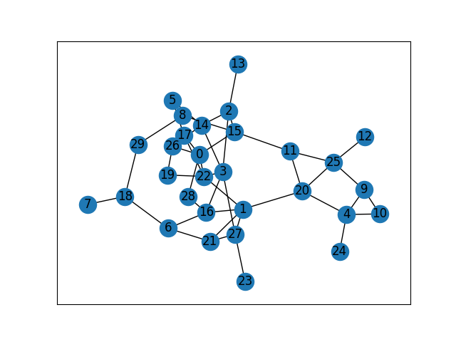

## DomiRank

Composite Centrality Indicator

### Project Introduction
Determining the key elements of interconnected infrastructure and complex systems is crucial for ensuring system functionality and integrity.

This work quantifies the dominance of network nodes within their respective communities, introducing a centrality indicator, DomiRank, which integrates local and global topological information through tunable parameters. We propose an analytical formula for DomiRank centrality and an efficient parallelizable algorithm, making it applicable to large-scale networks.

From the perspective of network structure and function, nodes with high DomiRank values highlight vulnerable neighborhoods whose integrity and function highly depend on these dominant nodes.

To emphasize this relationship between dominance and vulnerability, we demonstrate that DomiRank systematically outperforms other centrality indicators in generating targeted attacks that effectively disrupt the network structure and impair its function in both synthetic and real-world topologies.

Furthermore, we show that attacks based on DomiRank cause more persistent damage in the network, hindering its resilience and thus undermining system resilience. DomiRank centrality leverages the competitive mechanism embedded in its definition to reveal the vulnerabilities of the network, paving the way for designing strategies to mitigate vulnerabilities and enhance the resilience of critical infrastructure.

```shell
.
├── LICENSE
├── README.md
├── README_en.md
├── document.ipynb
├── drank.py
├── graph_ER.png
├── contrary.png
├── img
│   ├── result_degree.png
│   └── result_domirank.png
├── requirements.txt
└── src # Original author's code
    ├── domirank.py
    └── main.py
```

### Project Usage Screenshot

```shell
$ /bin/python3 /home/user-name/gitpro/DomiRank/main.py
Current Interval : [-16.0, -1.0]
Current Interval : [-16.0, -1.3061224489795917]
Current Interval : [-16.0, -1.695364238410596]
Current Interval : [-16.0, -2.183368869936034]
Current Interval : [-16.0, -2.7845003399048265]
Current Interval : [-16.0, -3.509102591561362]
Current Interval : [-5.75584050588442, -3.509102591561362]
Current Interval : [-5.75584050588442, -3.8885691399412585]
Current Interval : [-5.75584050588442, -4.231780649431364]
Current Interval : [-5.75584050588442, -4.531766526135183]
Current Interval : [-5.75584050588442, -4.786234354432965]
Current Interval : [-5.75584050588442, -4.996663920229527]
Current Interval : [-5.349451522475211, -4.996663920229527]
Current Interval : [-5.349451522475211, -5.08042536166895]
Current Interval : [-5.349451522475211, -5.145112832261159]
Current Interval : [-5.349451522475211, -5.194719892650121]
Current Interval : [-5.349451522475211, -5.2325575171891305]
Current Interval : [-5.349451522475211, -5.261299452856269]
Current Interval : [-5.349451522475211, -5.28306397494625]
Current Interval : [-5.349451522475211, -5.299505903552105]
Current Interval : [-5.349451522475211, -5.311904668416593]
Current Interval : [-5.349451522475211, -5.321241882312559]
Current Interval : [-5.349451522475211, -5.32826636305423]
Current Interval : [-5.349451522475211, -5.333546906349911]
Current Interval : [-5.349451522475211, -5.337514187568367]
Current Interval : [-5.349451522475211, -5.340493523837423]
Current Interval : [-5.349451522475211, -5.342730209679854]
Current Interval : [-5.349451522475211, -5.3444089539462]
Current Interval : [-5.346929049327728, -5.3444089539462]
Current Interval : [-5.346929049327728, -5.345038755059907]
Current Interval : [-5.346929049327728, -5.345511203314456]
Current Interval : [-5.346929049327728, -5.345865594318641]
Current Interval : [-5.346929049327728, -5.3461314184105495]
Current Interval : [-5.346929049327728, -5.346330803828948]
Current Interval : [-5.346929049327728, -5.346480352652945]
Current Interval : [-5.346929049327728, -5.346592519761527]
Current Interval : [-5.346929049327728, -5.346676648181617]

 The optimal sigma was found to be: 0.8799126416163416/-lambda_N
 
Our muti-threaded algorithm took: 7.222913026809692s
Our single-threaded algorithm took: 2.182962417602539s
```

Given Network E-R Diagram



Comparison with Degree Attack Strategy


### Installation Instructions

```shell
$pip install -r requirements.txt
```

### Usage Instructions

| Return Value | Function Name               | Parameters | Explanation |
| ------------ | --------------------------- | ---------- | ----------- |
|              | get_largest_component       |            | Get the largest component of the graph |
|              | relabel_nodes               |            | Relabel the nodes |
|              | get_component_size          |            | Get the size of the largest component of the graph |
|              | get_link_size               |            | Get the number of edges in the graph. |
|              | remove_node                 |            | Remove a node |
|              | generate_attack             |            | Generate an attack based on the centrality measure |
|              | network_attack_sampled      |            | Attack the network in a sampled way |
|              | domirank_by_annalytical     |            | Calculate DomiRank using the analytical method |
|              | domirank_by_recursive       |            | Calculate DomiRank using the recursive method |
|              | find_eigenvalue             |            | Find the largest negative eigenvalue of the adjacency matrix |
|              | process_iteration_thread    |            | Iterative process |
|              | optimal_sigma               |            | Solve for sigma |

### Algorithm Explanation

#### Explanation of Parameters

| Parameter | Explanation                                                          |
| --------- | -------------------------------------------------------------------- |
| sigma     | Returned by other functions                                          |
| dt        | Step size. Usually, 0.1 is fine enough for most networks (it may cause problems for networks with extremely high degree values) |
| epsilon   | Precision, default `1e-5`                                            |
| maxiter   | The depth you search before convergence or divergence occurs.         |
| checkstep | The number of steps to take before checking for convergence or divergence. |

#### Solving Algorithm
The first algorithm for the recursive search method is given as follows:

```python
def domirank_by_recursive(G, sigma, dt, epsilon, maxIter, checkStep)->(bool, []):
    sigmaG = sigma*G
    node_count = len(G.nodes())
    ranks = [1/node_count]*node_count
    maxranks = [0] * (maxIter/checkStep)
    checktimes = 0
    boundary = epsilon*node_count*dt
    for i in range(maxIter):
        v = ((sigmaG*(1-ranks))-ranks)*dt
        ranks += v
        if i % checkStep == 0:
            # Check for convergence
            if np.abs(v).sum() < boundary:
                return True, ranks
			maxranks[checktimes] = max(v)
            # If the rank increases after multiple iterations, it means the recursive search method fails and the parameters need to be adjusted.
            if checktimes > 0 && np.all(np.diff(arr[:checktimes+1])>=0):
					return False, ranks
			checktimes++
```

If using the analytical method, directly use the method in `scipy`, which can be solved with one line of code.
It is equivalent to solving the following system of equations:
$$
(\sigma G + E)x=\sigma D
$$
where G is the sparse matrix of the network, $\sigma$ is the calculated value, x is the final solved `domirank`, and D is the degree of each node in the graph.

```python
sp.sparse.linalg.spsolve(
        sigma*G + sp.sparse.identity(G.shape[0]), sigma*G.sum(axis=-1))
```

#### Calculation Method of $\sigma$
Use the random attack method. After randomly attacking the nodes of DomiRank, select the sigma with the smallest connected component.

```python
def optimal_sigma(G, endVal, startval, ittimes, dt, epsilon, maxIter, checkStep, sampling)->(float, []):
    sigmalst = np.linspace(startval, endval, ittimes+1)
    result = dict()
    for sigma in sigmalst:
    	_, domiDist = domirank_by_recursive(G, sigma, dt, epsilon, maxIter, checkStep)
		# Generate an attack
    	domiAttack = generate_attack(domiDist)
    	# Attack the sampled network
    	ourTempAttack, __ = network_attack_sampled(G, domiAttack, sampling=sampling)
    	# Calculate the sum of the largest connected components for each attack
    	finalErrors = ourTempAttack.sum()
        results[sigma] = finalErrors
	return min(results, key=results.get), results.values()
```

The value of `endval` here is obtained through the formula, and the largest negative eigenvalue of the adjacency matrix is calculated by the bisection method.
$$
endcal = -0.9999/eigenvalue
$$

```python
def find_eigenvalue(G, minVal=0, maxVal=1, maxDepth=100, dt=0.1, epsilon=1e-5, maxIter=100, checkStep=10):
	x = (minVal + maxVal)/G.sum(axis=-1).max()  # Maximum + minimum value / maximum degree, a random number should also be applicable
    for i in range(maxDepth):
        if maxVal - minVal < epsilon:  # If the difference between the maximum and minimum values is less than epsilon, break the loop
            break
        if domirank_by_recursive(G, x, dt, epsilon, maxIter, checkStep)[0]:
            minVal = x  # Update the minimum value
        else:
            maxVal = (x + maxVal)/2  # Update the maximum value
        x = (minVal + maxVal)/2
        if minVal == 0:  # If the minimum value is 0
            print(f'Current Interval : [-inf, -{1/maxVal}]')  # Print the current interval
        else:
            print(f'Current Interval : [-{1/minVal}, -{1/maxVal}]')  # Print the current interval
    finalVal = (maxVal + minVal)/2  # Calculate the final value
    return -1/finalVal  # Return the final value
```

### Project Update Plan
For specific content, please refer to [Document File](document.ipynb)

### Copyright Information
This project is licensed under the MIT license. For details, please refer to LICENSE.md.

### Acknowledgments
This project is fully implemented with reference to [DomiRank Centrality: revealing structural fragility of complex networks via node dominance](https://github.com/mengsig/DomiRank). Thank you for the original author's sharing!

If you use this repository, please cite the following manuscript.
https://www.nature.com/articles/s41467-023-44257-0#citeas

Engsig, M., Tejedor, A., Moreno, Y. et al. DomiRank Centrality reveals structural fragility of complex networks via node dominance. Nat Commun 15, 56 (2024). https://doi.org/10.1038/s41467-023-44257-0 